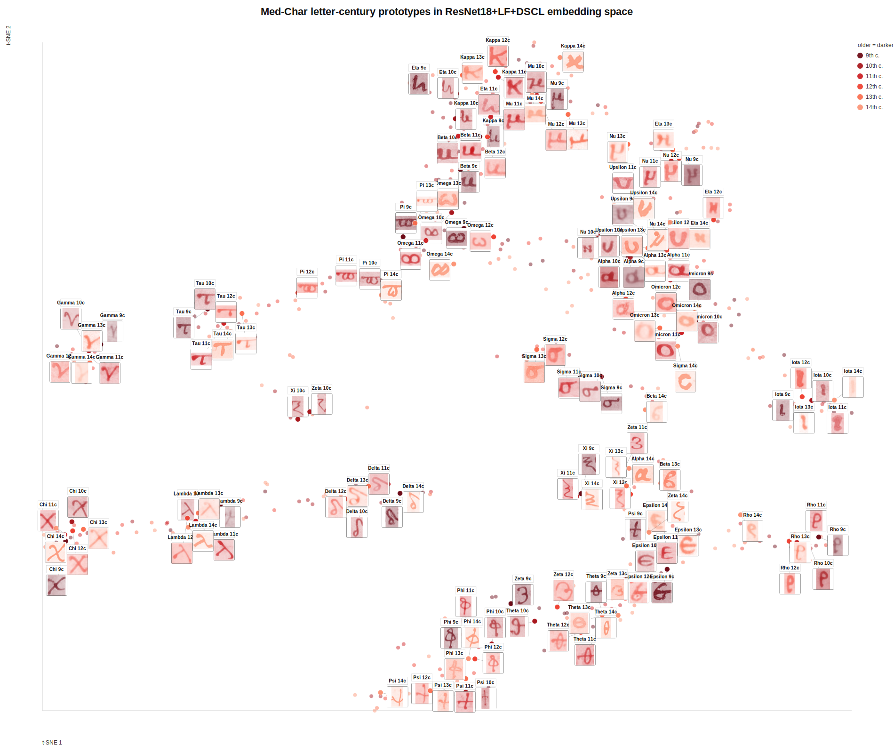

# Learning Diachronic Representations of Ancient Greek Letterforms

This repository accompanies the paper *"Learning Diachronic Representations of
Ancient Greek Letterforms."* It contains the three Greek letter datasets
introduced in the paper, the PyTorch implementation of our two methodological
contributions, and the scripts that reproduce the main tables and figures.

We study how modern representation learning captures the variation of Greek
handwriting across more than two millennia. Two domain-driven ideas drive the
work:

- **LF — Lacuna-driven Fragmentation augmentation.** Instead of rectangular
  cut-out erasure, we mask images with irregular *elliptic* lacunae that
  approximate real manuscript damage (flaking, humidity, worm holes).
  Implemented as `RandomLacunae` in [`source.py`](source.py).
- **DSCL — Dynamically similarity-weighted Supervised Contrastive Loss.** A
  supervised contrastive loss whose negative pairs are re-weighted by a
  dynamically re-estimated inter-class similarity matrix, so visually similar
  letters (e.g. Alpha/Lambda) are not pushed apart as hard as unrelated ones.
  Implemented as `SimilarityWeightedSupConLoss` in [`source.py`](source.py),
  with weight `w_ia = 1 + λ · S_{y_i,y_a} / S̄`.

The best model in the paper is **ResNet18, pre-trained and fine-tuned, with
LF + DSCL**, which attains 0.83 accuracy/F1 on Hell-Char and produces embeddings
that cluster by letter far better than PCA or generic pre-trained features.

## Interactive embedding map

A t-SNE projection of the Med-Char letter embeddings, with one real cliplet per
letter–century group overlaid in front of the points (coloured blue = older →
red = more recent, one marker shape per century):

[](https://htmlpreview.github.io/?https://github.com/ipavlopoulos/diachronic-greek-letterforms/blob/main/visual_artifacts/letter_century_plot_resnet_reproduced.html)

▶ **[Open the interactive version](https://htmlpreview.github.io/?https://github.com/ipavlopoulos/diachronic-greek-letterforms/blob/main/visual_artifacts/letter_century_plot_resnet_reproduced.html)** — hover any point for its letter and year (generated by `scripts/reproduce_letter_century_plot.py`).

## Datasets

All three datasets are character-level "cliplets" (single-letter crops),
grayscale, with a CSV of metadata. They are provided under [`data/`](data/).

| Dataset | Period | Role | Images | Classes |
|---|---|---|---|---|
| **Hell-Char** | 3rd–1st c. BCE | training / benchmark | 13,014 | 24 |
| **PaLit-Char** | 2nd–5th c. CE | evaluation (near) | 384 | 24 |
| **Med-Char** | 9th–14th c. CE | evaluation (far, diachronic shift) | 574 | 24 |

Hell-Char is a curated subset of Hell-Date (Ferretti et al., 2025); PaLit-Char
and Med-Char are newly compiled here. The full Hell-Char subset has 13,046
cliplets; 13,014 fall in the 24 letter classes used here, the remainder forming
a merged non-alphabetic category that is ignored.

## Installation

```bash
git clone https://github.com/ipavlopoulos/diachronic-greek-letterforms.git
cd diachronic-greek-letterforms
pip install -r requirements.txt
```

GPU is recommended for training; evaluation and the bundled demo run on CPU.
Reproducing the t-SNE figure as PDF additionally needs `rsvg-convert`
(`librsvg`), a system package.

## Repository layout

```
source.py                     core library: models, LF/RE augmentation, DSCL loss, datasets, training loop
scripts/
  train_resnet_lf_dscl.py     ResNet18 trainer (LF/RE/none x DSCL/SCL/none, pretrained or scratch)
  train_fcnn_variant.py       lightweight CNN (fCNN) trainer with the same options
  train_resnet_pt_ft_ce.py    ResNet18 pre-trained + fine-tuned, cross-entropy baseline
  train_timm_backbone.py      ViT-16S / ConvNeXt-V2 trainers (preliminary backbones, future work)
  evaluate.py                 Hell-Char classification (Table 1) + embedding clustering (Table 2)
  eval_diachronic.py          PaLit-Char / Med-Char generalization (Table 3)
  reproduce_figure4.py        temporal error boxplot on Med-Char (Fig. 4)
  reproduce_letter_century_plot.py   letter-century t-SNE map of Med-Char embeddings (Fig. 5)
  reproduce_letter_forms.py   per-letter cluster medoids ("letter forms")
  reproduce_confusion_similarity.py  confusion matrix + learned similarity matrix
  create_aug3_examples.py     augmentation-vs-real-damage figure
  extract_representations.py  export embeddings for a directory of cliplets
models/resnet_lf_dscl/        bundled main checkpoint (ResNet18-PT+FT + LF + DSCL) + summary
data/{hellchar,palitchar,medchar}/   cliplets + CSV per dataset
notebooks/                    exploratory notebooks (training, clustering, demo)
```

The main model — **ResNet18-PT+FT + LF + DSCL** — is bundled at
`models/resnet_lf_dscl/best_resnet_lf_dscl_model.pth`, and every evaluation/figure
script uses it by default, so they run out-of-the-box without training. Newly
trained checkpoints are written under `runs/` (git-ignored); pass `--checkpoint`
to use one of those instead. The lightweight CNN checkpoint
`best_cnn_letter_model.pth` is also included for the demo notebook.

## Reproducing the paper

Every command is run from the repository root. Training writes a checkpoint and
a `*_summary.json` under `runs/<name>/`; point the evaluation/figure scripts at
that checkpoint.

### Table 1 — Classification on Hell-Char

| Row | Command |
|---|---|
| fCNN | `python scripts/train_fcnn_variant.py` |
| fCNN + RE | `python scripts/train_fcnn_variant.py --use-rectangular-erasure` |
| fCNN + LF | `python scripts/train_fcnn_variant.py --use-lf` |
| fCNN + LF + DSCL | `python scripts/train_fcnn_variant.py --use-lf --use-dscl` |
| ResNet18-FT (scratch) | `python scripts/train_resnet_lf_dscl.py --no-pretrained --erasure none --no-contrastive` |
| ResNet18-PT+FT | `python scripts/train_resnet_lf_dscl.py --erasure none --no-contrastive` |
| ResNet18-PT+FT + SCL | `python scripts/train_resnet_lf_dscl.py --erasure none --contrastive-loss scl` |
| **ResNet18-PT+FT + LF + DSCL** (main) | `python scripts/train_resnet_lf_dscl.py` |

Then score a checkpoint (reports Accuracy and macro-F1; `--per-letter` adds the
per-class report):

```bash
python scripts/evaluate.py --backbone resnet \
  --checkpoint models/resnet_lf_dscl/best_resnet_lf_dscl_model.pth
```

### Table 2 — Clustering of the embeddings (Hell-Char)

`evaluate.py` also clusters the embeddings (k-means / Spectral / Agglomerative)
and reports NMI and ARI against the letter labels — the same command as above.
The `Otsu+PCA` and pre-trained-only baselines are computed in
[`notebooks/cnn_embeddings_clustering.ipynb`](notebooks/cnn_embeddings_clustering.ipynb).

### Table 3 — Diachronic generalization (PaLit-Char, Med-Char)

```bash
python scripts/eval_diachronic.py \
  --checkpoint models/resnet_lf_dscl/best_resnet_lf_dscl_model.pth \
  --datasets palitchar medchar
```

### Figures

| Figure | Command |
|---|---|
| Augmentation vs. real damage | `python scripts/create_aug3_examples.py` |
| Letter forms (Alpha medoids) | `python scripts/reproduce_letter_forms.py --checkpoint models/resnet_lf_dscl/best_resnet_lf_dscl_model.pth` |
| Temporal error boxplot (Fig. 4) | `python scripts/reproduce_figure4.py --checkpoint models/resnet_lf_dscl/best_resnet_lf_dscl_model.pth` |
| Letter-century t-SNE (Fig. 5) | `python scripts/reproduce_letter_century_plot.py --checkpoint models/resnet_lf_dscl/best_resnet_lf_dscl_model.pth` |
| Confusion + similarity matrices | `python scripts/reproduce_confusion_similarity.py --checkpoint models/resnet_lf_dscl/best_resnet_lf_dscl_model.pth` |

The t-SNE script writes an SVG (colours run **blue = older → red = more recent**,
with a distinct marker shape per century); convert it to PDF with
`rsvg-convert -f pdf in.svg -o out.pdf`. The boxplot height is adjustable via
`--fig-height` for a more compact figure.

### Preliminary transformer backbones (future work)

The paper notes that LF + DSCL also help ViT-16S and ConvNeXt-V2. Train them with:

```bash
python scripts/train_timm_backbone.py --model-name convnextv2_tiny --use-lf --use-dscl
python scripts/train_timm_backbone.py --model-name vit_small_patch16_224 --use-lf --use-dscl
```

## Quick start: export embeddings

```bash
python scripts/extract_representations.py data/palitchar/cliplets --output palitchar_representations.csv
```

## Citation

```bibtex
@inproceedings{pavlopoulos2026diachronic,
  title     = {Learning Diachronic Representations of Ancient Greek Letterforms},
  author    = {Pavlopoulos, John and Barbakos, Spyros and Ferretti, Lavinia and
               Voulgarakis, Dionysis and Paparrigopoulou, Asimina and
               Konstantinidou, Maria and De Gregorio, Giuseppe and
               Marthot-Santaniello, Isabelle and Platanou, Paraskevi and Essler, Holger},
  booktitle = {International Conference on Document Analysis and Recognition (ICDAR)},
  year      = {2026}
}
```

## License

Code and datasets are released under **CC BY 4.0** (see [`LICENSE`](LICENSE)).
The datasets build on Hell-Date and on material from securely dated papyri and
manuscripts; please also cite the originating resources.
